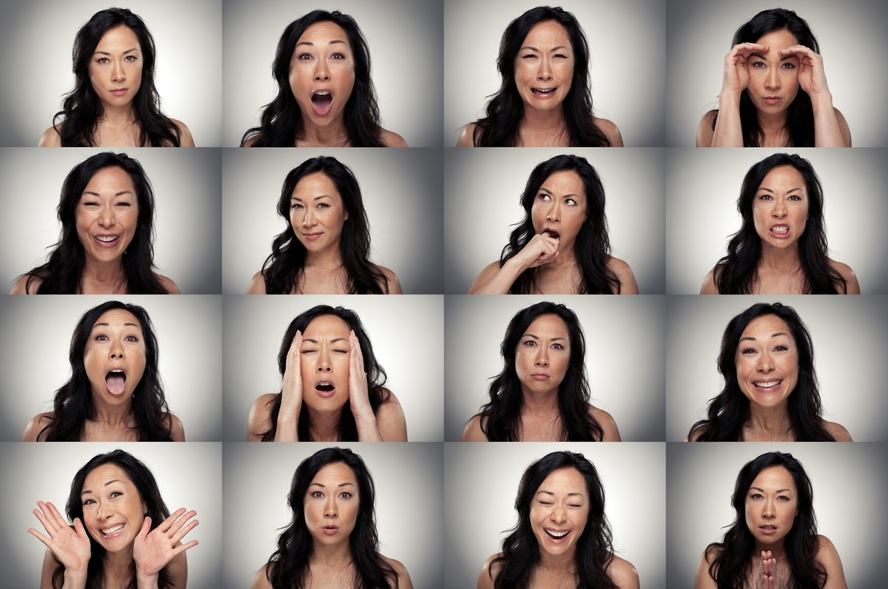
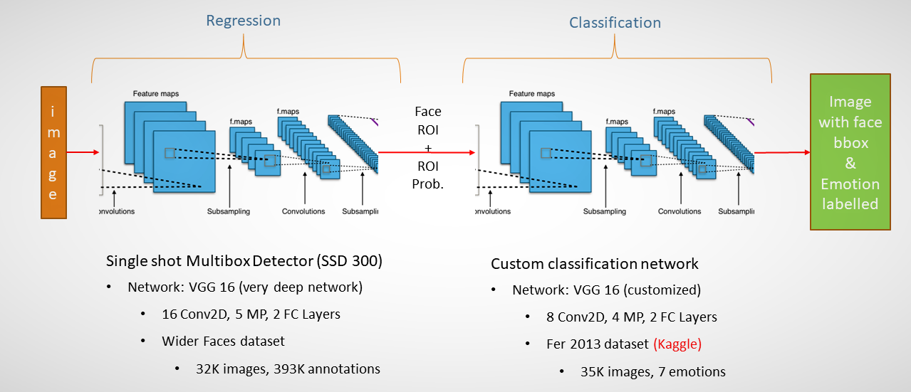

# EmotionClassification_FER2013

*Figure 1: Emotion classification headline*

Emotion classification has always been a very challenging task in Computer Vision. 
Using the FER 2013 released by Kaggle, this project couples an deep learning based face detector 
and an emotion classification DNN to classify the six/seven basic human emotions. 

## Basic Human Emotions (background):
Affective Computing has an annotation problem. Facial expression recognition is a difficult challenge 
because human emotions are very subjective and fluid. We never exhibit 100% of any particular emotion
and our emotions (exhibited through facial expression) are always a mixture of a number of emotions.

Having said so, human facial expressions and emotions can be broadly (and somwwhat incorrectly) classified
into 7 basic emotions which are as follows:
### emotions = [anger, disgust, fear, happy, sad, surprise, neutral]

However, based on recent research 
In 2013, Kaggle released a challenge [1] to classify these seven emotions using deep neural networks. This project is designed around that challenge to build, train and test a deep neural net to classify the seven emotions. 

NOTE: Although, by default we should classify all 7 emotions, a recent project in 2016 [2] noted that the classification accuracy is somewhat improved when the classes "anger and disgust" is merged into a single class "anger". Therefore, this project allows you to build the dataset for both 6 or 7 emotions depending upon requirements/wish. A marginal improvement in the final results can be noted when the emotions are merged.

## Dataset:
The FER 2013 dataset consists of 35887 images across 3 categories:

Summary:
#### Training set: 28709, Validation set: 3589, Test set: 3589 (across all 7 emotions)

 

*Figure 2: Left: total data distribution, right: emotion distribution (train + val + test) sets*

The above figures show clearly that the data is distributed in an 80 + 10 + 10 split where the validation and training data each consists of 10% of the total number of samples. Upon further investigation it was found that the number of samples belonging to the "disgust" class is remarkably lower (~1.5%) than the other classes, with "happy" (~25%) consisting the max number of samples. This is one of the primary reasons of merging the "anger" and "disgust" class to create a more balanced dataset as done by [2]. Thus, this project allows for emotion classification of either 6 or 7 emotions based on the choice of the user.

Finally, to explore the data distribution slightly further, the overall data is divided according to their usage (training/ validation/ test) and their distribution is given in the figures below:

  

   

*Figure 3: Emotion distribution across Training, Validation and Test data sets*

Again, as seen earlier in Figure 2, the data distributions shown in Figure 3 demonstrates that all three sets are more or less similar with the "disgust" class remarkably trailing (in number of samples) compared to other emotions.

OK, so finally we move to the next section which describes the overall pipeline of the project.

## Overall pipeline

*Figure 4: Emotion classification headline (localization & detection using SSD and classification using VGG like network*

The challenge presented in this project can be considered as a Regression and Classification challenge where the face detection is a regression problem and the detected ROI is then classified by a classification model trained FER 2013 dataset (detailed above).

Solution: Stack two deep learning based models (face detection + classification). The face detector is based on the Single Shot Multibox Detector (SSD) [3] which extracts the face from the input image. The face/faces (ROI) is/are then fed to the classification model which predicts and classifies the emotion (exhibited by the face) as shown in Figure 4. The output of this procedure (detection and classification is later shown in Section "Output". 

NOTE: Although, the output from the emotion classifier consists of probabiility distribution histogram, in this case, only the expression with most probability is extracted and shown as the output. 

## Network Architecture:

## References
[1] Ian J. Goodfellow et al. “Challenges in Representation Learning: A Report on Three Machine Learning Contests”. In: Neural Information Processing: 20th International Conference, ICONIP 2013, Daegu, Korea, November 3-7, 2013. Proceedings, Part III. Edited by Minho Lee et al. Berlin, Heidelberg: Springer Berlin Heidelberg, 2013, pages 117–124. ISBN: 978-3-642-42051-1. DOI: 10.1007/978-3-642-42051-1_16. URL: https://doi.org/10.1007/978-3-642-42051-1_16

[2] Jostine Ho. Facial Emotion Recognition. https://github.com/JostineHo/mememoji/

[3] Liu, Wei, Dragomir Anguelov, Dumitru Erhan, Christian Szegedy, Scott Reed, Cheng-Yang Fu, and Alexander C. Berg. "Ssd: Single shot multibox detector." In European conference on computer vision, pp. 21-37. Springer, Cham, 2016.
